# 我的数据

## 通用规则

**1.语言说明**  
当填写字段时，若出现语言选择项，“英文”字段为必填项。请根据界面提示准确输入内容，并确保所选语言类型与输入内容的实际语言一致。
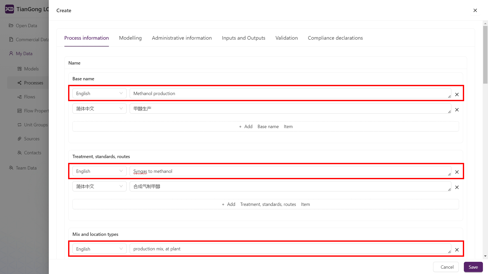  
**2.选择数据**  
对于“数据集格式”、“合规系统名称”等需选择的内容，进行如下操作：  
1.展开选择面板：点击所选内容边的“选择”键，点击后将弹出信息面板。  
2.切换信息分类：通过顶部导航栏可点选目标数据目录，界面将动态跳转至对应界面。  
3.数据选取：在列表中勾选目标信息（选中行显示紫色衬底），左侧状态栏同步显示所选数据。   
4.保存信息修改：点击编辑页底部“保存”按钮，系统返回上级面板。
  
**3.版本号**  
为防止客户端异常导致数据丢失，建议优先填写版本号并保存草稿，之后重新进入编辑界面继续填写其他内容，编辑过程中需定期手动保存进度。

## 新建过程与新建模型

### 新建过程

1. 展开数据面板：定位左侧导航栏，单击“我的数据”，激活数据管理界面。
2. 定位过程目录：在分级列表中选中“过程”条目，页面跳转至“我的数据/过程”空间。
3. 初始化过程框架：单击界面右上角“+”创建按钮，进入空白过程配置页面。
 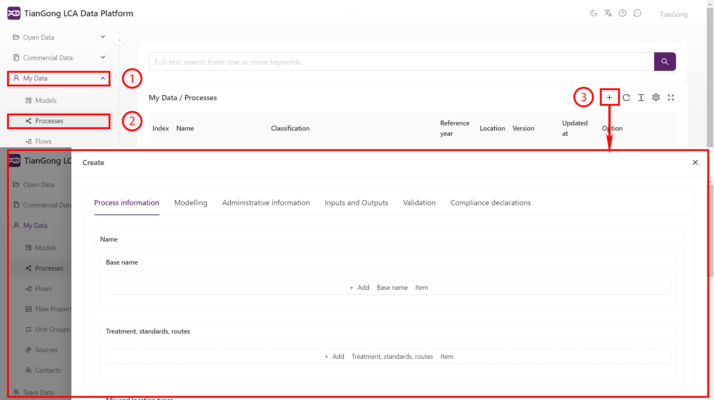  
4. 切换信息分类：通过顶部导航栏可点选目标数据目录，界面将动态跳转至对应界面。
5. 参数录入：依据字段提示逐项填入过程数据，填写完成后重复步骤4，直至“过程信息”“建模信息”“管理信息”均录入完成。
 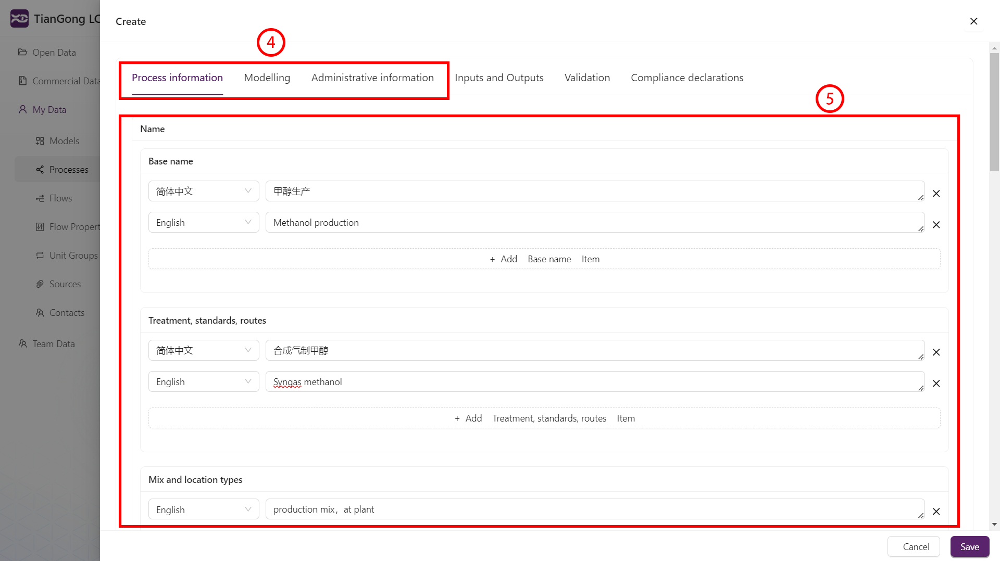  
6. 激活流管理模块：选择导航栏“输入与输出”标签，系统显示输入输出配置面板。
7. 新建流实例：根据数据流向需求，在INPUT/OUTPUT区域点击“+”符号，打开流创建子窗口。
8. 绑定流数据集：在流属性面板点击“引用流标识符”后的选择图标，从弹窗目录树勾选预存数据流。
9. 定义流量数值：定位至结果值对应字段，以填写流量数值。
10. 配置单位转换：弹出单位转换页面，填写结果值与其对应单位，系统自动建立数值关系。
11. 保存转换数据：点击转换页面底部“保存”按钮，系统返回上级面板。
12. 保存流数据：点击编辑页底部“保存”按钮，系统返回上级面板。重复步骤7至步骤12，直至所需的所有流均被添加。
 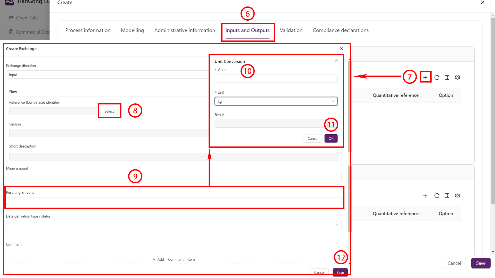
13. 编辑页面：在OUTPUT列表中找到主要输出流，单击左侧铅笔编辑图标，系统打开流编辑页面。
14. 基准流设定：定位至页面底部，打开“参考流”开关，将主要输出流设定为基准流。
15. 保存信息修改：点击编辑页底部“保存”按钮，系统返回上级面板。
16. 保存过程信息：最终点击过程页底部“保存”按钮，系统返回上级面板，过程配置完成。
 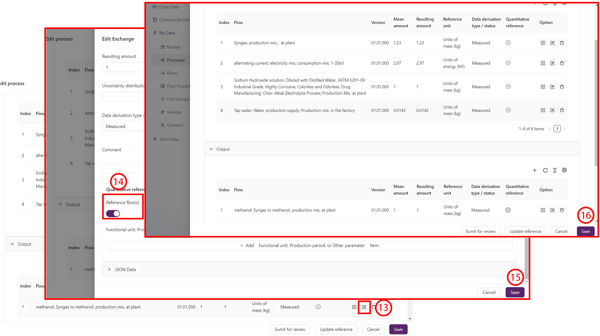

### 新建模型

1. 展开数据面板：定位左侧导航栏，单击“我的数据”，激活数据管理界面。
2. 定位过程目录：在分级列表中选中“模型”条目，页面跳转至“我的数据/产品模型”空间。
3. 初始化模型框架：单击界面右上角“+”创建按钮，进入空白模型配置页面。
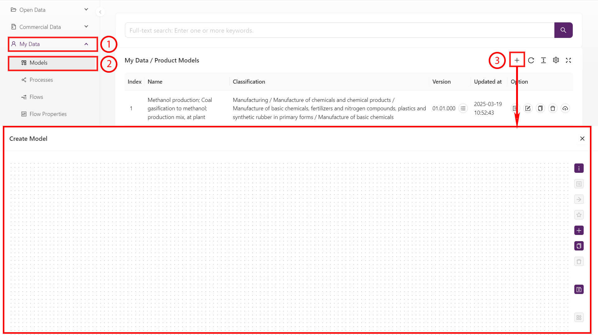 
4. 激活节点编辑器：定位右侧属性面板，单击“+”，弹出节点配置窗口。
5. 切换信息分类：通过顶部导航栏点选目标数据目录，界面将动态跳转至对应界面。
6. 节点数据选取：在节点列表中勾选目标过程（选中行显示紫色衬底），左侧状态栏同步显示已选3项节点数据。
7. 提交节点配置：点击窗口底部“提交”按钮，系统关闭弹窗并在画布中心生成节点示意图。
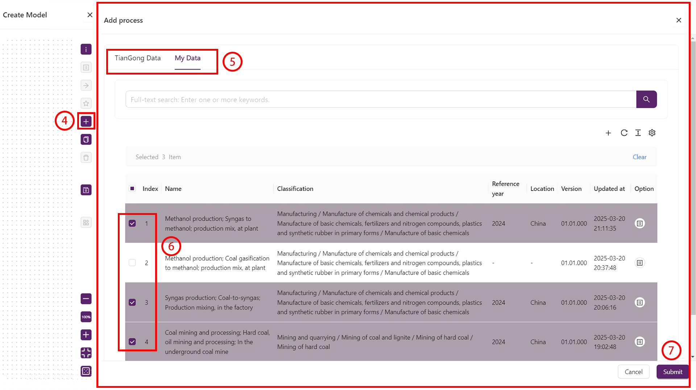 
8. 激活流管理面板：单击节点“输入/输出”按钮，右侧边栏滑出并显示节点相关流。
9. 多选关联数据流：在流列表中勾选目标流（选中行显示紫色衬底），右侧状态栏同步显示已选1项流数据。
10. 确认流绑定操作：点击侧边栏底部“提交”按钮，画布中节点自动生成对应数量的输入输出端口。
11. 建立流逻辑连接：按住上级节点输出端口拖拽至下级节点输入端口，释放后生成紫色数据流管线。
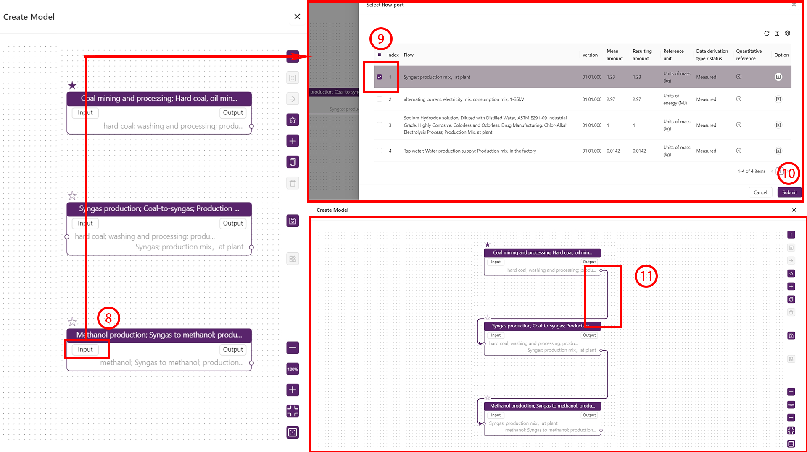 
12. 设定基准流程：点击目标过程名称旁的☆图标，将其设为基准过程（图标变为紫色实心★表示选中）。
13. 统一基准流量：系统将自动识别基准过程的基准流，核对提取的基准流名称是否符合所需，否则重新选择基准流程，在目标数量中输入目标量值，该数值将作为整个模型的统一基准流量。
14. 保存基准流：点击页面右侧“提交保存”按钮完成设置，基准流程图标将固定为紫色实心★，其他过程保持空心☆。
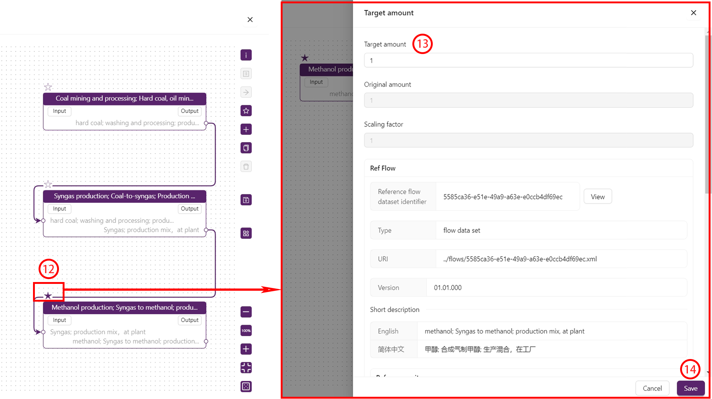 
15. 调取数据面板：点击右侧属性栏i形信息图标，界面右侧扩展显示”模型信息”折叠面板。
16. 切换信息分类：通过顶部导航栏点选目标数据目录，界面将动态跳转至对应界面。依据字段提示逐项填入模型信息，填写完成后重复步骤，直至“模型信息”“建模与验证”“管理信息”均录入完成。
17. 保存模型信息：点击编辑页底部“保存”按钮，系统返回上级面板。
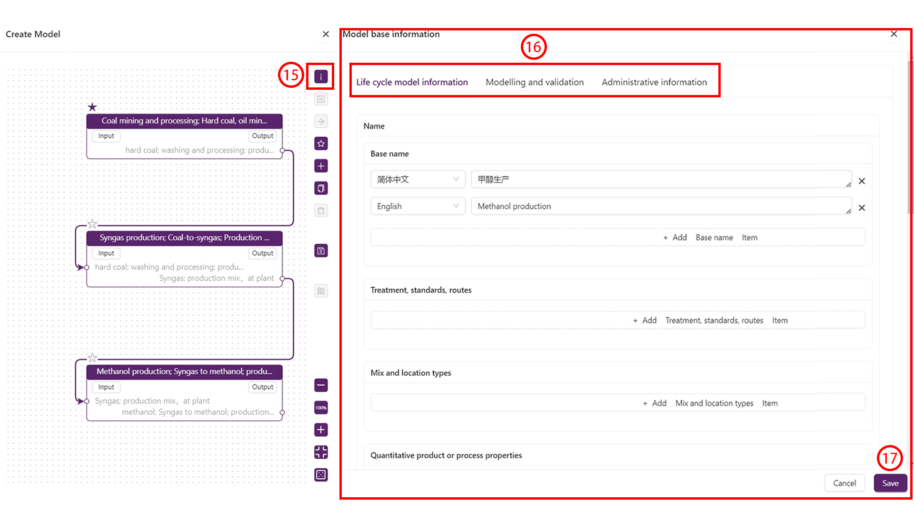 
18. 调取数据面板：点击右侧积木状图标，界面右侧扩展显示“模型结果”折叠面板。
19. 结果查看：点选顶部导航栏的“输入与输出”，查看最终结果。
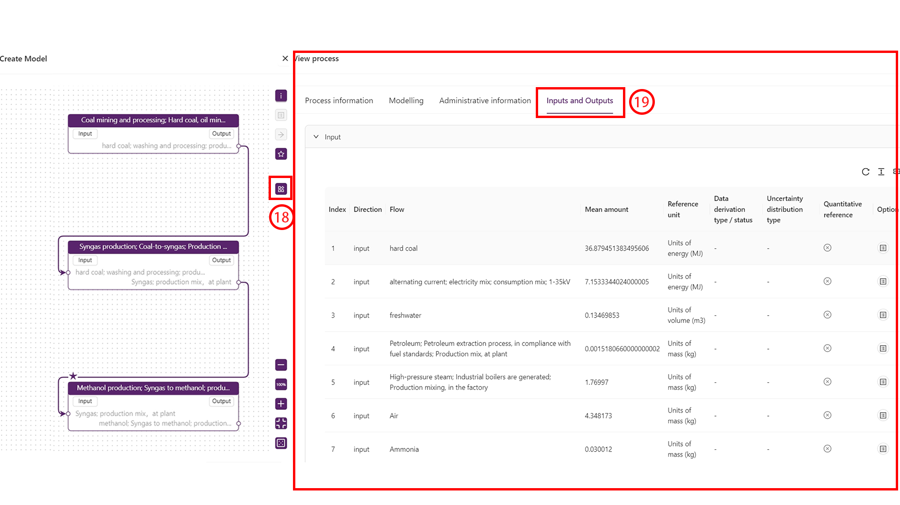 

>注意点：  
由多个单元过程组成的模型可视为一个新的综合过程。模型建立完成后，可作为过程使用，用户可在“我的数据”-“过程”中进行调用。

## 新建流

1. 展开数据面板：定位左侧导航栏，单击“我的数据”，激活数据管理界面。
2. 定位过程目录：在分级列表中选中“流”条目，页面跳转至“我的数据/流”空间。
3. 初始化模型框架：单击界面右上角“+”创建按钮，进入空白流配置页面。
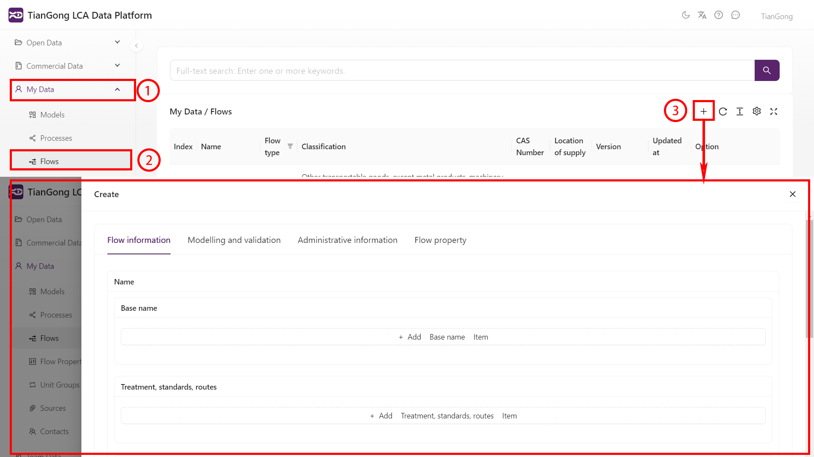
4. 切换信息分类：通过顶部导航栏点选目标数据目录，界面将动态跳转至对应界面。
5. 参数录入：依据字段提示逐项填入流数据，填写完成后重复步骤4，直至“流信息”“建模与验证”“管理信息”均录入完成。
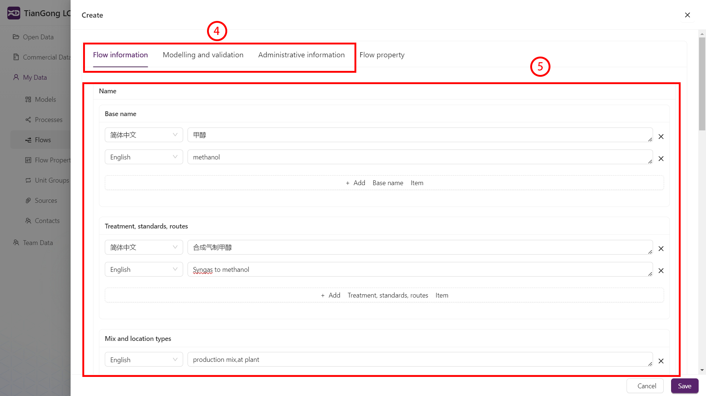
6. 激活流属性管理模块：选择导航栏“流属性”标签，系统显示流属性配置面板。
7. 新建流属性：点击右上角“+”符号，打开流属性创建子窗口。
8. 流属性的选择：在流属性面板点击“引用流属性标识符”后的选择图标，从弹窗目录树勾选预存数据流属性。
9. 定义流属性数值：定位至平均值值对应字段，填写属性数值。
10. 量值参考设定：依据实际需要，对“量值参考”进行设定。
11. 保存信息修改：点击编辑页底部“保存”按钮，系统返回上级面板，流属性配置完成。重复步骤7至步骤11，直至所需的所有流属性均被添加。
12. 保存过程信息：最终点击流页面底部“保存”按钮，系统返回上级面板，流配置完成。
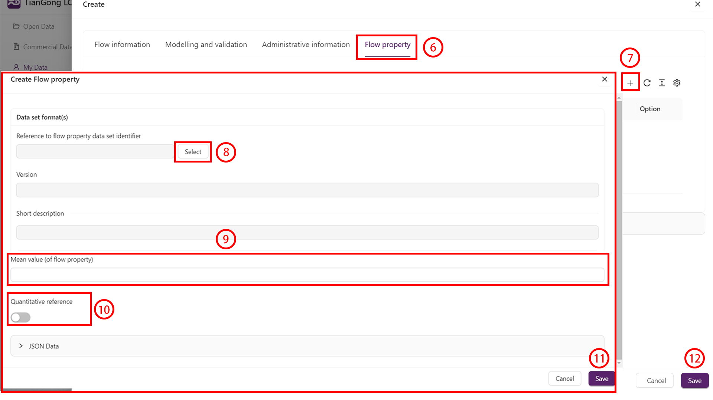    
 

## 新建联系人与新建来源

### 新建联系人

新建对象后，依据提示依次点击并填写“联系人信息”、“管理信息”。

>注意点：  
1.如在“联系人信息”-“分类”中选择了“个人”，且所创建的“个人”有归属组织，则可在最后的“属于”部分点击“选择”，在数据组中找到所归属的团队进行选择，以完善从属关系。  
2.如数据为更新数据，需在“管理信息”-“数据集前一版本”中选择上一版数据。

### 新建来源

新建对象后，依据提示依次点击并填写“源信息”、“管理信息”。

>注意点:  
1.来源引用必须符合严格的学术规范，如论文的引用格式应包含作者、题目、期刊、编号等。例：[Liu J., Zhao J., Wei H., et al., Comparative environmental assessment of methanol production technologies: A cradle-to-gate life cycle analysis[J]. Energy Conversion and Management, 2024, 302: 118128.](https://www.sciencedirect.com/science/article/abs/pii/S0196890424000694#:~:text=This%20article%20compares%20the%20state-of-the-art%20%E2%80%9Cliquid%20sunlight%E2%80%9D%20methanol,traditional%20pathways%20through%20a%20cradle-to-gate%20life%20cycle%20assessment.)  
2.依据格式规范，建议上传电子文档，点击“源信息”-“电子文档链接”处的“上传”框，在电脑内选择需要上传的文件，上传文件可多选。

## 新建单位组与新建流属性

天工数据平台虽支持用户自主创建“单位组”和“流属性”功能模块，但需要特别注意的是：此类自定义操作存在较高风险，可能导致计量单位换算异常及生命周期影响评价（LCIA）核算关联失效等问题。基于系统兼容性与数据准确性的考量，建议用户谨慎使用新建功能，原则上不推荐创建自定义单位组与流属性。

### 新建单位组

新建对象后，依据提示依次点击并填写“单位组信息”、“建模与验证”、“管理信息”。填写完成后，进行如下操作：

1. 激活单位组管理模块：选择导航栏“单位”标签，系统显示单位配置面板。
2. 新建单位：点击页面右上角的“+”符号，打开单位创建子窗口。
3. 定义单位信息：依据提示依次填写单位名、平均值等有关信息。
4. 量值参考设定：依据实际需求，对量值参考进行设定。
5. 保存单位信息：点击编辑页底部“保存”按钮，系统返回上级面板，单位配置完成。重复步骤2至步骤5，直至所需的所有单位均被添加。
6. 保存单位组信息：点击编辑页底部“保存”按钮，系统返回上级面板，单位组配置完成。

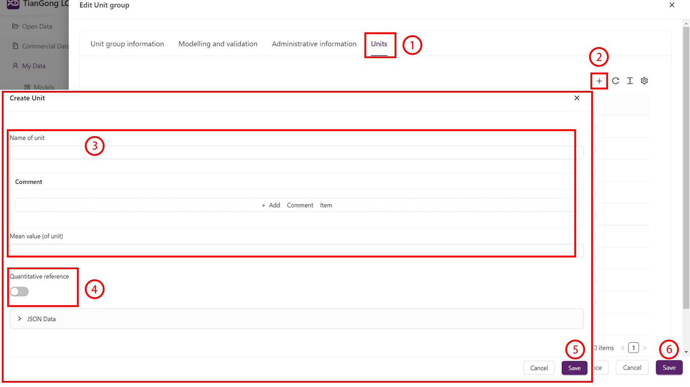  

>注意点：  
基准单位一般为单位组中最常用的单位（如质量组为“kg”，长度组为“m”），确定的基准单位应打开“创建单位”页面底部的量值参考键，以便辨认。

### 新建流属性

**信息填写**  
新建对象后，依据提示依次点击并填写“流属性信息”、“建模与验证”、“管理信息”。

>注意点：  
1.在填写过程中需注意，流属性分类中所选的“技术属性”、“化学成分”、“经济属性”、“其他属性”应与参考单位中所选单位组的属性分类中的“技术单位”、“化学成分单位”、“经济单位”、“其他单位”相对应。  
2.如数据为更新数据，需在“管理信息”-“数据集前一版本”中选择上一版数据。

>**由于新建过程涉及相互引用，故建议新建流程为：联系人->来源->单位组->流属性->流->过程->模型**