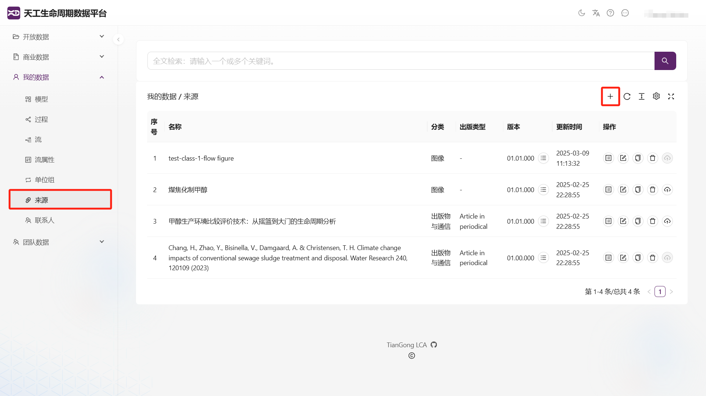

# 我的数据

**我的数据**模块由单元过程、流、流属性、单位、来源、联系人六部分构成，用户可以根据需要自主构建数据。

## 单元过程

用户可以通过点击页面上的“+”来创建新的单元过程，

在输入输出流部分，用户可以通过点击“+”来添加相关的输入输出流。

## 流

用户可以通过点击“+”来创建新流，

成功创建新流后，可在右侧构建“模型”，

进入模型构建页面后，通过点击“+”创建并编辑模型，

在模型编辑页面，用户可以通过点击“+”添加节点，并通过拖拽节点方框的边缘点来调整方向；点击右侧的“i”可以添加模型的基本信息，

点击箭头符号并选择“交换关系”来添加交换关系，选择源输出流和目标输入流。

## 流属性

用户可以通过点击“+”来创建新的流属性。

## 单位

用户可以通过点击“+”来创建新的单位。

```bash
天工数据的单位模块已按照国际标准构建，用户可直接引用。
```

## 来源

在天工生命周期数据平台中，来源模块用于定义和管理与数据集相关的来源信息，包括文献、报告、研究数据或其他相关资料。

### 创建一条新的“来源”数据

#### 第一步：点击“+”按钮新增来源数据

- 打开平台的“我的数据--来源”模块。

- 点击右上角的“+”按钮，新增“来源”数据。



#### 第二步：填写来源的基本数据

##### 源信息

**源的简称（建议填写）**：输入数据来源的简短名称，通常为文献、报告、研究数据或其他内部数据源的引用。为了确保数据的完整性和便于国际化使用，请同时提供中文和英文版本的名称。

- 示例：
- 文献来源：Smith et al., 2021
- 数据库：ecoinvent 3.7
- 内部数据源：公司数据集

**分类（建议填写）**：您需要选择一个合适的“分类”来标识数据的来源类型。请根据数据来源的实际类型选择以下类别之一：

图像

- 选择条件：如果您的数据来源是图示、流程图或任何形式的可视化信息（如图像、示意图、流程图等），请选择“图像”类别。
- 填写示例：如果来源是一张包含关键数据流的流程图或示意图，可以选择此类别。

出版物与通信

- 选择条件：如果您的数据来源是文献、报告、书籍或其他出版物，选择“出版物与通信”类别。
- 填写示例：例如，学术论文、会议报告、技术报告等都应选择此类别。

数据集格式

- 选择条件：如果数据来源是某种格式的数据库或结构化数据集，选择此类别。
- 填写示例：如公开的LCA数据库（如ecoinvent、GaBi等），或任何特定格式数据集都应选择此类别。

数据库

- 选择条件：如果数据来源是通过某个数据库提供的，可以选择此类别。
- 填写示例：例如，从Sphera、ecoinvent等数据库中获取的数据。

合规系统

- 选择条件：如果数据来源来自符合某些标准或法规的系统，选择此类别。
- 填写示例：例如，符合ISO 14040或其他生命周期评估相关标准的数据系统。

 **来源引用（建议填写）**：此字段用于输入数据来源的完整引用信息。无论是外部文献、内部数据源、数据库工具，还是图片或合规系统，您都需要在此字段中提供详细的来源引用。

文献引用

- 如果数据来源是文献，请按照标准引文格式（使用Nature格式）填写。例如："Pedreño-Rojas, M. A., Fořt, J., Černý, R. & Rubio-de-Hita, P. Life cycle assessment of natural and recycled gypsum production in the Spanish context. Journal of Cleaner Production 253, 120056 (2020)."

内部数据源

- 如果引用的是内部数据源，请清楚标明数据的来源，例如：公司内部数据集：项目A数据（2023年）.

数据库和工具

- 如果数据来自数据库或工具，请注明数据库名称及版本（如适用）。例如：ecoinvent 3.7 (2023)，或 Sphera LCA Database (2022).

数据集格式

- 如果来源是数据集格式，请注明数据格式类型和版本，例如：CSV格式数据集，版本1.2.

图片或图示

- 如果数据来源为图像或图示，请注明图片标题和来源出处，例如：流程图：生命周期评估流程图（图1），来源：Ecoinvent报告（2023）.

合规系统

- 如果数据源来自合规系统或符合特定标准的系统，请提供合规标准及其版本号，例如：ILCD合规数据集，ISO 14040:2006.

**出版类型（选填）**：在出版类型字段中，您需要选择数据来源的具体出版类型。以下是每个出版类型的详细解释和填写指南：

未定义（Undefined）

- 如果数据来源的出版类型无法确定或尚未定义，可以选择此项。
- 例如：您暂时不清楚来源的具体类型，或者来源没有明确分类。

期刊文章（Article in periodical）

- 选择此类型如果数据来源是期刊中的文章，通常是经过同行评审的学术期刊。
- 例如：Environmental Science & Technology, Vol. 50, Issue 12, pp. 3342-3351.

文集章节（Chapter in anthology）

- 选择此类型如果数据来源是书籍中的一章节或论文集中的一篇文章。
- 例如：Smith, J. "Sustainable Manufacturing," in *Sustainable Practices in Industry*, Publisher XYZ, 2020.

专著（Monograph）

- 选择此类型如果数据来源是单独出版的专著或学术书籍。
- 例如：Sustainable Energy Practices, John Smith, Publisher XYZ, 2020.

直接测量（Direct measurement）

- 选择此类型如果数据来源是通过直接测量或实验获取的数据。
- 例如：通过现场实验或测量得到的数据。

口头交流（Oral communication）

- 选择此类型如果数据来源是通过口头交流得到的信息，例如会议上的演讲、电话交流等。
- 例如：John Smith, oral communication, March 2023.

个人书面交流（Personal written communication）

- 选择此类型如果数据来源是个人的书面交流或电子邮件等形式的通信。
- 例如：John Smith, personal email, February 2023.

问卷调查（Questionnaire）

- 选择此类型如果数据来源是通过问卷调查收集的。
- 例如：Survey conducted by XYZ Company, 2023.

软件或数据库（Software or database）

- 选择此类型如果数据来源是某个软件或数据库。
- 例如：ecoinvent 3.7 database, Swiss Centre for Life Cycle Inventories, 2023.

其他未发布或灰色文献（Other unpublished and grey literature）

- 选择此类型如果数据来源是未发布的文献、灰色文献、报告或其他形式的未公开资料。
- 例如：Internal report, Company XYZ, 2023.

注意：**如果您的数据来源属于其他特殊类别**，选择“其他未发布或灰色文献”，并在后续的“数据源描述或备注”中说明详细情况。

**数据源描述或备注（选填）**：在数据源描述或备注字段中，简要说明数据来源的内容、使用的媒介类型（例如CD-ROM、硬拷贝等），以及任何其他相关信息，帮助其他用户理解和验证数据的背景。例如：

- 已发布的期刊文章：描述期刊文章的摘要及其媒介形式（如电子版或纸质版）。
- 内部数据源：描述如何收集数据、数据的适用范围或用途限制等。

**电子文档链接（选填）**：电子文档链接字段用于提供数据来源的数字文件链接。填写此字段后，其他用户可以直接访问相关的数字文档（如完整报告或其他附加文档），并可与数据集一起共享。

上传文件

- 如果您需要上传文件，点击“上传”按钮，选择本地文件进行上传。上传的文件将作为附件添加到数据集中，方便其他用户直接下载。

用途说明

- 该链接用于提供完整报告或额外的文档支持，确保数据来源的透明性。如果文档内容较长或包含大量数据，提供此链接有助于用户获取详细背景信息。

**属于（选填）**：此字段用于指明该数据集、数据源格式或合规系统所属的工作组、组织或数据库网络。请注意，这一字段的填写并不意味着存在法律上的绑定关系，而是指该数据集属于某个工作组、组织或自愿加入的网络。

##### 管理信息

**时间戳**：此字段用于记录数据集生成的时间和日期。这是一个自动生成的字段，当您创建或保存数据集时，系统会自动填入当前的时间和日期，无需手动输入。

**数据集格式（建议填写）**：此字段用于指定数据集采用的格式。默认情况下，数据集格式为ILCD format，这是一种标准的生命周期评估（LCA）数据格式，用于确保数据的互操作性和可交换性。
    [图片]

**数据集版本**：数据集版本由系统在创建或更新数据集时自动生成，用户无需手动填写。

**数据集拥有者（建议填写）**：此字段用于标明拥有该数据集的个人或实体。填写的是与数据集关联的主要联系人或数据所有者，而不是数据集的发布者。

**永久数据集统一资源标识符（建议填写）**：用于为数据集指定一个全球唯一的标识符，支持用户和软件工具通过互联网识别和检索该数据集的原始版本或检查是否有更新。此字段由系统根据数据集的UUID（通用唯一标识符）和数据集所有者的URL自动生成。用户无需手动填写此字段。

#### 第三步：保存并确认数据

- 在完成所有字段的填写后，请务必检查每一项内容，确保所有必填字段已完整填写且无误。

- 确认无误后，点击页面底部的“保存”按钮，系统将自动保存您的源信息。

- 提交后，您可以查看已保存的源信息记录，确认其是否正确显示在您的数据集管理列表中。

## 联系人

用户可以通过点击“+”来创建联系人，允许用户录入个人信息及团队信息。
